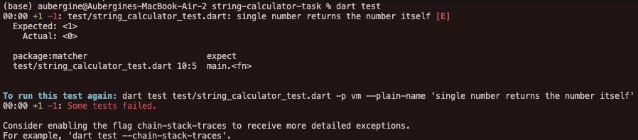
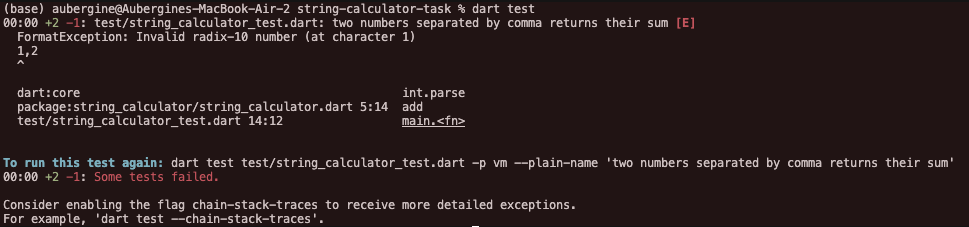
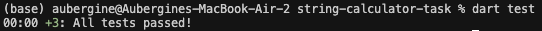
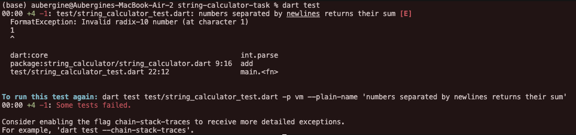
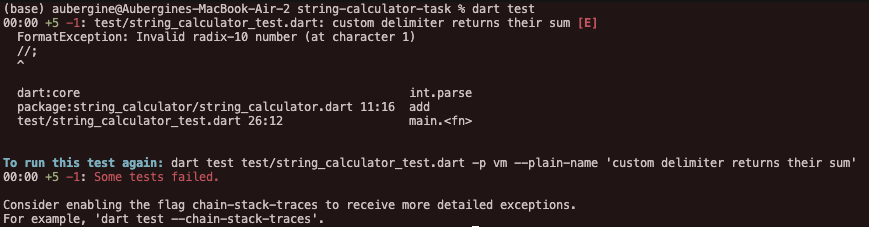
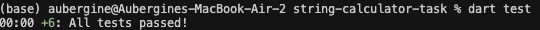
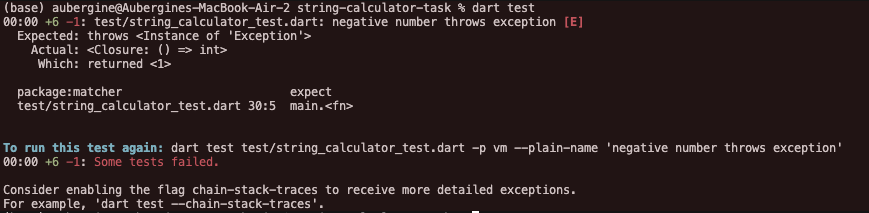
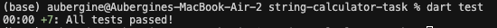
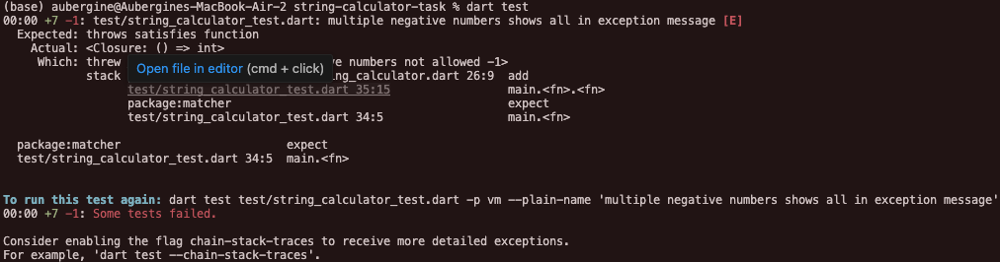
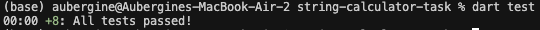

# String Calculator - TDD Implementation

A String Calculator implementation following Test-Driven Development (TDD) practices, as specified in the kata requirements.

## Assignment Requirements

Create a simple String calculator with a method signature like this:

```dart
int add(String numbers)
```

### Features Implemented

1. **Empty String**: Input `""` → Output `0`
2. **Single Number**: Input `"1"` → Output `1`
3. **Two Numbers**: Input `"1,5"` → Output `6`
4. **Any Amount of Numbers**: Handle unlimited comma-separated numbers
5. **Newline Delimiters**: Support `"1\n2,3"` → Output `6`
6. **Custom Delimiters**: Support `"//;\n1;2"` → Output `3`
7. **Negative Number Validation**: Throw exception for negative numbers
8. **Multiple Negatives**: Show all negative numbers in exception message

## TDD Journey - Red-Green-Refactor Cycles

### Cycle 1: Empty String

- **RED**: Test for `add('')` should return `0`
- **GREEN**: Simple implementation returning `0`
- **REFACTOR**: No refactoring needed
- **Result**: ✅ Basic foundation established

### Cycle 2: Single Number

- **RED**: Test for `add('1')` should return `1` - FAILED (returned 0)



- **GREEN**: Added logic to parse single number with `int.parse()`
- **REFACTOR**: Clean separation between empty and non-empty cases
- **Result**: ✅ Handles empty string and single number

### Cycle 3: Two Numbers

- **RED**: Test for `add('1,2')` should return `3` - FAILED (FormatException)



- **GREEN**: Added string splitting by comma and sum calculation
- **REFACTOR**: No refactoring needed
- **Result**: ✅ Handles comma-separated numbers



### Cycle 4: Multiple Numbers (Discovered Already Working)

- **Test**: `add('1,2,3,4,5')` should return `15` - PASSED immediately
- **Discovery**: Current implementation already handles any amount of numbers
- **Result**: ✅ Requirement fulfilled without additional code

### Cycle 5: Newline Delimiters

- **RED**: Test for `add('1\n2,3')` should return `6` - FAILED (FormatException)



- **GREEN**: Added newline replacement with commas before splitting
- **REFACTOR**: Minimal change to existing logic
- **Result**: ✅ Supports both commas and newlines as delimiters


### Cycle 6: Custom Delimiters

- **RED**: Test for `add('//;\n1;2')` should return `3` - FAILED (FormatException)



- **GREEN**: Added custom delimiter parsing from `//[delimiter]\n` format
- **REFACTOR**: Extracted delimiter detection and number processing logic
- **Result**: ✅ Supports custom delimiters as specified



### Cycle 7: Negative Number Exception

- **RED**: Test for `add('-1,2')` should throw exception - FAILED (returned 1)



- **GREEN**: Added negative number detection and exception throwing
- **REFACTOR**: Added proper error handling
- **Result**: ✅ Throws exception for negative numbers



### Cycle 8: Multiple Negative Numbers

- **RED**: Test for `add('-1,2,-3')` should show both negatives - FAILED (only showed first)



- **GREEN**: Collect all negative numbers before throwing exception
- **REFACTOR**: Improved exception message formatting
- **Result**: ✅ Shows all negative numbers in exception message



## Final Test Suite

### All Tests Passing ✅


### Passing Tests ✅

```dart
test('empty string returns 0', () {
  expect(add(''), 0);
});

test('single number returns the number itself', () {
  expect(add('1'), 1);
});

test('two numbers separated by comma returns their sum', () {
  expect(add('1,2'), 3);
});

test('multiple numbers separated by comma returns their sum', () {
  expect(add('1,2,3,4,5'), 15);
});

test('numbers separated by newlines returns their sum', () {
  expect(add('1\n2,3'), 6);
});

test('custom delimiter returns their sum', () {
  expect(add('//;\n1;2'), 3);
});

test('negative number throws exception', () {
  expect(() => add('-1,2'), throwsException);
});

test('multiple negative numbers shows all in exception message', () {
  expect(() => add('-1,2,-3'),
         throwsA(predicate((e) => e.toString().contains('-1') && e.toString().contains('-3'))));
});
```

### Test Results

- **Total Tests**: 8
- **Passing**: 8 ✅
- **Failing**: 0 ❌
- **Coverage**: All requirements implemented

## Final Implementation

The final `add()` method handles all requirements:

- Empty strings and single numbers
- Multiple numbers with comma or newline delimiters
- Custom delimiter format (`//[delimiter]\n[numbers]`)
- Comprehensive negative number validation with detailed error messages

## Running the Tests

```bash
dart test
```

Expected output:

```
00:00 +8: All tests passed!
```
